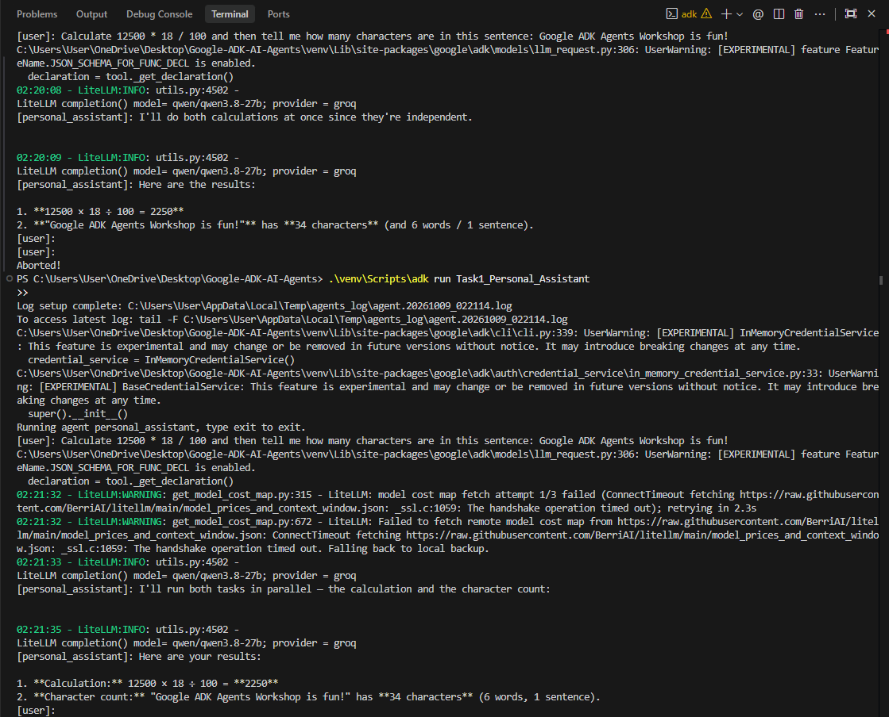
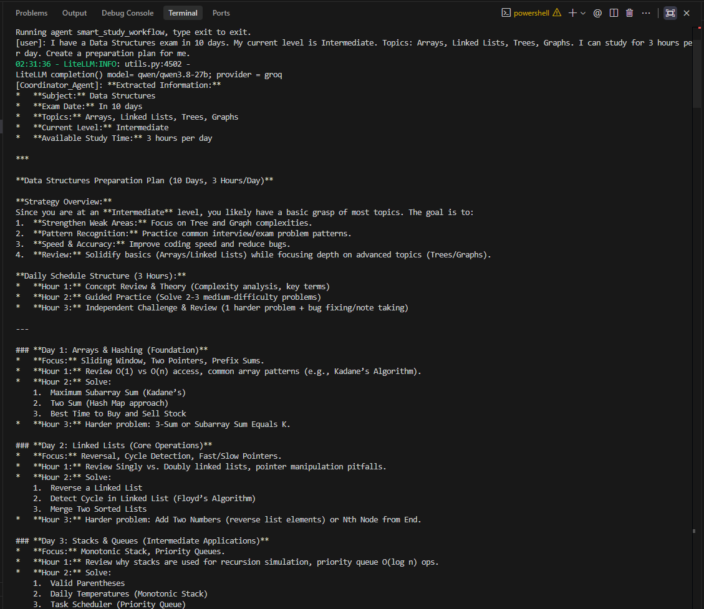

<div align="center">

  

  <h1>Google ADK AI Agents</h1>
  <p><strong>A complete multi-agent AI system built with Google Agent Development Kit (ADK), featuring a personal assistant and an intelligent multi-agent study planner.</strong></p>

  <p>
    
    
    
    
    
  </p>

  <p>
    
    
  </p>

</div>

---

## 📖 Overview

This repository is a complete implementation of the **Google ADK Workshop** — a hands-on exploration of building intelligent AI agents with Google's open-source Agent Development Kit.

The project covers two distinct agent architectures:

- **Task 1** demonstrates a **single-agent system** with custom Python tools, capable of reasoning across tools to answer complex multi-part questions.
- **Task 2** demonstrates a **multi-agent orchestration workflow** — with sequential pipelines, parallel execution, and iterative review loops — to produce a high-quality, personalized 10-day exam study plan.

> **Note on LLM Provider:** Google Gemini's free tier has aggressive quota limits on newer models. This project is configured to use the **Groq API** (specifically `qwen/qwen3.8-27b`) via the `litellm` extension — providing a completely free, high-speed, and reliable alternative without any billing setup.

---

## 🗂️ Project Structure

```
Google-ADK-AI-Agents/
│
├── Task1_Personal_Assistant/       # Single-agent personal assistant
│   ├── agent.py                    # Agent definition + custom tools
│   └── __init__.py
│
├── Task2_SmartStudy_Planner/       # Multi-agent study planner workflow
│   ├── agent.py                    # Full 7-agent workflow definition
│   └── __init__.py
│
├── docs/
│   └── google_adk_workshop_task.md # Original workshop task description
│
├── .env.example                    # Environment variable template
├── requirements.txt                # Python dependencies
└── README.md
```

---

## ⚙️ Task 1 — Personal Assistant Agent

A versatile, single-agent AI assistant that intelligently selects and invokes custom Python tools based on the user's request.

### Architecture

```
            User
              │
              ▼
    ┌─────────────────┐
    │ Personal        │
    │ Assistant Agent │
    └────────┬────────┘
             │
   ┌─────────┴──────────┐
   ▼         ▼           ▼
 Google   Calculator  Text Analyzer
 Search   (Custom)     (Custom)
 (built-in)
```

### Tools

| Tool | Type | Purpose | Input | Output |
|:---|:---|:---|:---|:---|
| `google_search` | Built-in | Fetches live information from the web | Search query string | Relevant search results |
| `calculator` | Custom Python | Evaluates mathematical expressions | Expression string e.g. `"12500 * 18 / 100"` | Computed numeric result |
| `text_analyzer` | Custom Python | Analyzes text metrics | Any text string | Character count, Word count, Sentence count |

### Example Interactions

```
User   → "Calculate 18% GST on ₹25,000."
Agent  → [calls calculator("25000 * 18 / 100")] → "The GST amount is ₹4,500."

User   → "Analyze this paragraph and count its words."
Agent  → [calls text_analyzer("...")] → "Characters: 45 | Words: 8 | Sentences: 1"
```

<div align="center">
  
  <p><i>Task 1 Agent successfully utilizing custom tools to parse user requests.</i></p>
</div>

---

## 🧠 Task 2 — SmartStudy Planner (Multi-Agent Workflow)

A sophisticated multi-agent orchestration system that generates a personalized 10-day exam preparation plan for any subject. It demonstrates all three core workflow patterns taught in the workshop.

### Agent Roster

| # | Agent | Role |
|:---|:---|:---|
| 1 | **Coordinator Agent** | Parses user input — extracts subject, topics, level, days, and daily study time |
| 2 | **Planning Agent** | Prepares structured requirements and kicks off parallel analysis |
| 3 | **Topic Agent** | Assigns Priority (High/Med/Low), Difficulty, and Focus for each topic |
| 4 | **Practice Agent** | Recommends problem count and practice type per topic |
| 5 | **Schedule Agent** | Converts available hours into a realistic day-by-day calendar |
| 6 | **Study Plan Writer** | Combines parallel outputs into one cohesive draft study plan |
| 7 | **Review Agent** | Validates the draft and triggers refinement if needed (max 2 loops) |

### Workflow Architecture

```
User Input
    │
    ▼
┌───────────────────┐
│  Coordinator      │  ← Parses: Subject, Topics, Level, Days, Hours/day
└────────┬──────────┘
         │ Sequential
         ▼
┌───────────────────┐
│  Planning Agent   │  ← Structures requirements for parallel analysis
└──┬──────┬──────┬──┘
   │      │      │  Parallel
   ▼      ▼      ▼
[Topic] [Practice] [Schedule]    ← All 3 run independently & simultaneously
   │      │      │
   └──────┴──────┘
         │ Merge
         ▼
┌───────────────────┐
│ Study Plan Writer │  ← Aggregates all 3 outputs into one draft
└────────┬──────────┘
         │
         ▼
┌───────────────────┐
│  Review Agent     │  ← Validates: coverage, time, practice, revision, mock test
└────────┬──────────┘
         │
    ┌────┴────────────────────┐
    │ "Needs Improvement"?    │   Loop (max 2 iterations)
    └────────────────────────►─► back to Writer
         │ "APPROVED"
         ▼
    Final 10-Day Study Plan ✅
```

### Workflow Patterns Demonstrated

| Pattern | Implementation |
|:---|:---|
| **Sequential** | `Coordinator → Planning Agent → Writer` |
| **Parallel** | `Planning → (Topic \| Practice \| Schedule)` simultaneously |
| **Loop** | `Writer → Reviewer → Writer` (maximum 2 iterations) |

### Test Input

```text
I have a Data Structures exam in 10 days.
My current level is Intermediate.
Topics:
- Arrays
- Linked Lists
- Trees
- Graphs
- Dynamic Programming

I can study for 3 hours per day.
Create a preparation plan for me.
```

<div align="center">
  
  <p><i>Task 2 Multi-Agent Workflow successfully generating a concise 10-day study plan.</i></p>
</div>

---

## 🚀 Installation & Setup

### Prerequisites
- Python 3.10 or higher
- Git
- A free [Groq API key](https://console.groq.com) (no credit card required)

### 1. Clone the Repository

```bash
git clone https://github.com/sumitrawat2417/Google-ADK-AI-Agents.git
cd Google-ADK-AI-Agents
```

### 2. Create and Activate a Virtual Environment

**Windows:**
```bash
python -m venv venv
.\venv\Scripts\activate
```

**macOS / Linux:**
```bash
python3 -m venv venv
source venv/bin/activate
```

### 3. Install Dependencies

```bash
pip install google-adk
pip install "litellm>=1.75.5"
```

### 4. Configure Environment Variables

Create a `.env` file in the root directory:

```env
GROQ_API_KEY=your_groq_api_key_here
```

> Get your free API key at [console.groq.com](https://console.groq.com) — sign in with Google, no billing required.

---

## 💻 Running the Agents

Run both agents using the Google ADK CLI from the project root:

### Task 1 — Personal Assistant

```bash
adk run Task1_Personal_Assistant
```

**Try these prompts:**
```
Calculate 12500 * 18 / 100 and then tell me how many words are in this sentence: Google ADK makes building AI agents incredibly easy.
```

### Task 2 — SmartStudy Planner

```bash
adk run Task2_SmartStudy_Planner
```

**Use the full test input:**
```
I have a Data Structures exam in 10 days. My current level is Intermediate.
Topics: Arrays, Linked Lists, Trees, Graphs, Dynamic Programming
I can study for 3 hours per day. Create a preparation plan for me.
```

---

## 🛠️ Tech Stack

| Technology | Role |
|:---|:---|
| [Google ADK](https://google.github.io/adk-docs/) | Agent orchestration framework |
| [LiteLLM](https://docs.litellm.ai/) | Universal LLM routing layer |
| [Groq API](https://console.groq.com) | Free, ultra-fast LLM inference |
| `qwen/qwen3.8-27b` | Underlying language model (via Groq) |
| Python 3.10+ | Core runtime |

---

## 🔒 Security Notice

- **Never commit your `.env` file or API keys to version control.**
- The `.gitignore` is configured to exclude `.env` by default.
- Before sharing or submitting this project, verify that no API keys are present in any file.

---

## 📄 License

This project was created as an exploration of the **Google ADK (Agent Development Kit)**. All custom code is open-source and available for educational use.

---

<div align="center">
  <sub>Built with ❤️ by <a href="https://github.com/sumitrawat2417">Sumit Rawat</a> · Google ADK Workshop 2026</sub>
</div>
